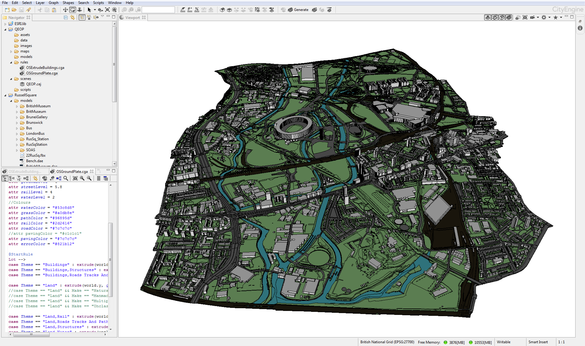

# OS Building Height Attribute In CityEngine
Basic CityEngine rule files for processing Ordnance Survey MasterMap data with Building Height Attribute:
https://www.ordnancesurvey.co.uk/business-and-government/products/os-mastermap-building-height-attribute.html

## OSExtrudeBuildings.cga
This rule is applied to building foot prints that have the building height attribute attached. Footprints will be extruded using the relative height attribute `relh2`. The resulting building models are also translated vertically by a set value in order to rest correctly on the layered terrain created by the `OSGroundPlate.cga` rule. The translation can be commented `//` or removed if a Heightmap is being used to generate a terrain instead of the `OSGroundPlate.cga` rule.

## OSGroundPlate.cga
This rule can be used to generate a terrain for visualisation purposes in the absence of a Heightmap. This is achieved by selecting features from the Ordnance Survey MasterMap data (e.g. roads and pavements), extruding the selected polygons by a predefined amount, and translating the geometry for each type of feature vertically in order to create a terraced effect. The different layers can also be coloured to differentiate them.

**Note:** The latter rule does not create an accurate terrain. Neither is it instended as a comprehensive rule for processing OS MasterMap data. Instead it is intended as a short demonstation of the possibilities for processing and visualising certain GIS data in CityEngine.

# Acknowledgements

These rules were created for demonstration purposes during research at The Bartlett Centre for Advanced Spatial Analysis (CASA). This research was jointly funded by the Ordnance Survey (OS) of Great Britain and the Engineering and Physical Science Research Council (EPSRC).
